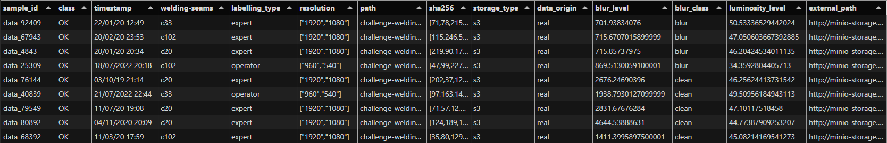

## Dataset metadescriptoin

All datasets accessible in the challenge are described with a parquet file containing the metadescription of a sample
A parquet file is a format  representing a dataframe. For each sample the following fields are acessible :

| **Field**             | **Description** |
|----------------------|----------------|
|sample_id| Unique identifier for the sample, following the template "data_X". |
|class| Real state of the welding present in the image; this is the ground truth. Two values are possible: OK or KO.|
|timestamp | Datetime when the photo was taken; this field is not expected to be useful.|
|welding-seams | Name of the welding seam to which the welding belongs. Welding seams are named "c_X".|
|labelling_type | Type of person who annotated the data. Two possible values: "expert" or "operator".|
|resolution | List containing the resolution of the image [width, height].|
|path | Internal path of the image in the challenge storage.|
|sha256 | A unique hexadecimal key representing the image data, used to detect alteration or corruption in the storage.|
|storage_type | Type of sample storage: "s3" or "filesystem".|
|data-origin | 	Type of data. This field has two possible values: "real" or "synthetic". The provided datasets contain only real samples.|
|blur_level | Level of blur in the image, measured numerically using OpenCV. The lower this value, the blurrier the image.|
|blur_class | Class of blur deduced from the "blur_level" field. Two classes are considered: "blur" and "clean". The value is set to "blur" when the blur level is below 950.|
|lumninosity_level | Percentage of luminosity in the image, measured numerically.|
|external_path | URL of the image. This URL can be used by challengers to directly download the sample from storage.|

## Dataset example

### Example_mini_dataset
For now, a first example of dataset is provided . Purpose of this dataset named "example_mini_dataset" is to a give an overview of the final dataset that would be provided for the official start of this challenge.
This dataset contains 2857 images of weldings splitted into 3 different welding-seams (c102,c20,c33).
The metadata file of this dataset can be found here : [example_mini_dataset metadata](https://minio-storage.apps.confianceai-public.irtsysx.fr/challenge-welding/datasets/example_mini_dataset/metadata/ds_meta.parquet)

This an example of the first 9 rows of this metadescription file



The whole dataset can be downloaded directly as a zip file : [Download example_mini_dataset](https://minio-storage.apps.confianceai-public.irtsysx.fr/challenge-welding/datasets/example_mini_dataset.zip)]

#### Welding-detection-challenge-dataset

The final dataset provided with this challenge is named ```welding-detection-challenge-dataset```. It contains 22753 images of weldings covering three different welding-seams named c20, c102 anc c33.
The metadata file of this dataset can be found here : [welding-detection-challenge-dataset metadata](https://minio-storage.apps.confianceai-public.irtsysx.fr/challenge-welding/datasets/welding-detection-challenge-dataset/metadata/ds_meta.parquet)

The whole dataset can be downloaded directly as a zip file : [Download welding-detection-challenge-dataset](https://minio-storage.apps.confianceai-public.irtsysx.fr/challenge-welding/datasets/welding-detection-challenge-dataset.zip)]
