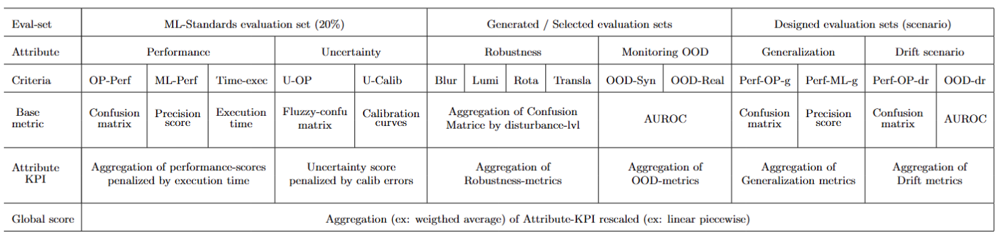

# Expected solution specification

As it was explained in the main presentation, the aim of this challenge is to build an AI component which take an image of welding as input and return as output , the predicted class of the welding (OK , KO) or UNKNOWN . UNKNOWN is used to say that model is not sure about the predicted class. As we will see later in the evaluation process an unknown output can be less penalizing than a False Negative (meaning a true KO predicted as OK) that have a critical cost.

From the evaluation process point of view , the AI component is considered as a black box. It means that the full evaluation process is only based on inference results of the submitted AI component on different datasets. It is not needed to access to the AI component architecture, layers, or gradient of neural network.

Thus the minimal requirement for any solution submitted is to have the following requirement.

The submitted zip folder to codabench by participant shall have the following requirements:

A "challenge_solution "folder shall contain at least three files :
- ```__init__.py``` : This is a file that is necessary to ensure that all files in this directory will be integrated to the python package of your component when it will be built .
- ```AIComponent.py``` : The interface module of your AI component that shall contain a class named ```MyAIComponent``` describing the interface of your component.

This class shall have at least two main methods that will be used by the evaluation pipeline named :
- load_model() : load whatever is needed in the virtual env to be able to use the predict method .
- predict() : Perform predictions on a list of input images, and return the list of predictions.

- A ```requirements.txt``` file listing all dependencies with exact versions of needed packages.
- A ```setup.py``` file that will be used to build the python package of your AI component. This setup shall use the requirement.txt file.
- A ```MANIFEST.IN``` file that is needed to  list all additionnal files you may have added to be used in your  ```challenge_solution``` folder to ensure that they will be integrated in your AI component python package

This interface class statisfy the following abstract class given in file challenge-welding/AIComponent_interface.py

```
class AbstractAIComponent(ABC):
    """
    Abstract base class for AI components interface.
    """
    def __init__(self):
        self.AI_Component=None
        self.AI_component_meta_informations={}
    @abstractmethod
    def load_model(self,config_file=None):
        """
        Abstract method to load the model into the AI Component.
        Should be implemented by all subclasses.
        
        Parameters:
            config file : str
                A optional config file that could be used for the AI component loading
        
        """
        pass

    @abstractmethod
    def predict(self, input_images: list[np.ndarray], images_meta_informations: list[dict]) -> dict :
        """
        Abstract method to make predictions using the AI component.
        
        Parameters:
            input_images: list[np.ndarrays]
                The list of images numpy arrays
            images_meta_information: list[dict]
                The list of images metadata dictionaries 
                
        Returns:
            A dict containing 4 keys "predictions", "probabilities", "OOD_scores"(optional),"explainability"(optional). 
                predictions : A list of the predictions given by the AI component among 3 possible values [KO, OK UNKNOWN"]
                probabilities : A list of 3-values lists containing predicted scores for each sample in this order [proba KO, proba OK, proba UNKNOWN]. sum of proba shall be 1 for each lists  
                OOD_scores : A list of  OOD score predicted by the AI component for each sample. An ood score is a real positive number. The image is considered OOD when this score is >=1
                explainabilities  : A list of explainabilities for each sample . An explainability is an intensity matrix (a numpy array contaning only real numbers between 0 and 1) representing the importance level of each pixel on input image in the decision leading to the final prediction of your AI component. 
        """
        pass


```
To sum-up, your AI component shall have at least the following files and folder :

```
setup.py
MANIFEST.in
requirements.txt
challenge_solution/
    __init__.py
	AIComponent.py
```
You are free to add any other files you need to this structure in order to make your AI component working.

## Example of AI Component

An example of such AI component is provided in this repository in this folder ```reference-solutions/Solution-1/ ```.
This AI component is not designed to have good performance but just to show what is expected to be compatible with the evaluation pipeline
An example of script loading this AI component and test it via inference computations is given [here](../examples/03-Test_AIComponent.ipynb)

# Evaluation process

The Trustworthy AI Challenge aim to build a trustworthy AI-Component that assists in weld seam conformity qualification. The evaluation of a trustworthy AI-Component will be done across several dimensions of trustworthy to ensure it reliability, robustness, and efficiency facing real observation that may be affected by hazards. The evaluation framework consists of six "trust-attributes" : \textbf{Performance, uncertainty, robustness, ood monitoring, generalization, and drift}.  These aspects are some of the trust attributes that may determine the AI system’s ability to operate effectively in real-world scenarios as for example be robust to small environmental hazard, generalize across datasets, express confidence or be able to face anomalies.

From the predictions made by the developed AI component on many evaluation datasets, we will compute a set of different evaluation criteria as discussed below:

- **Performance metrics**: Measure the gain brought the AI component compared to a human only qualification process. This metrics is based on the confusion matrix and penalize strongly false negative predictions. 

- **Uncertainty metrics**: Measure the ability of the AI component to produce a calibrated prediction confidence indicator expressing risk of model errors.

- **Robustness metrics**: Measure the ability of the AI component to have invariant output is images have slight perturbations (blut, luminosity, rotation, translation)

- **OOD-Monitoring metrics**: Measure the ability of the AI component to detect if an input image is ood, and gives the appropriate output ->Unknown

- **Generalisation metrics**: Measure the ability of the AI component to generalize to a unseen context.

- **Drift metrics**: Measure the ability of the AI component to generalize to a unseen context.
 
# Trustworthy ML Challenge Evaluation Protocol

## Multi-Criteria Aggregation Methodology

The evaluation of models in the trustworthy ML challenge follows a multi-criteria aggregation methodology designed to ensure a fair and reliable assessment of various attributes. The following table illustrates this metrics aggregation principle.




The aggregation process consists of several key steps:

1. Computation of Attribute Metrics
  - Several metrics are computed for each attribute based on specific evaluation sets in order to taking into account various criteria. 
  - These evaluation sets are either constructed or generated specifically to assess different aspects of the attribute's performance.

2. Normalization of Attribute Metrics :
  - All attribute-specific metrics are transformed into a score within the range [0,1], where 1 represents the best possible performance.
  - To achieve this normalization, appropriate transformations such as sigmoid functions or exponential decay are applied, depending on the nature of the metric.
$$ OP_{score} = e^{-k*Metric_{OP-Perf}}\ and\ U_{Score} = sigmoid(Metric_{U-OP}) $$

3. Attribute-KPI Aggregation
  - A specific aggregation formula is applied at the attribute-KPI to combine these different metrics into a unified attribute score.
  - This ensures a comprehensive representation of each attribute’s performance.
$$KPI_{X} = agg({metric}_{X^1},..,{Xmetric}_{X^k})$$

4. Piecewise Linear Rescaling of Attribute-KPI.
  - To ensure consistency and comparability across attributes, the attribute scores undergo a piecewise linear rescaling process.
  - This rescaling takes into account both predefined performance and confidence requirements.
  - These adjustments ensure that the scores align with realistic evaluation constraints.
$$f'(x) =
\begin{cases}
\frac{\beta_1}{\alpha_1} f(x), & 0 \leq f(x) < \alpha_1 \\
\frac{\beta_2 - \beta_1}{\alpha_2 - \alpha_1} (f(x) - \alpha_1) + \beta_1, & \alpha_1 \leq f(x) \leq \alpha_2 \\[8pt]
\frac{1 - \beta_2}{1 - \alpha_2} (f(x) - \alpha_2) + \beta_2, & \alpha_2 < f(x) \leq 1
\end{cases}$$

5. Weighted Aggregation of Attributes
  - The rescaled attribute scores are then aggregated into a final evaluation score using a weighted  mean.
  - The weights assigned to each attribute reflect its relative importance in the overall trustworthy assessment framework.
$$\alpha_1*I^{perf} + \alpha_2*I^{U} + \alpha_3*I^{Rob} + \alpha_4*I^{ood} + \alpha_5*I^{gen}+\alpha_6*I^{drift}$$

The purpose of this aggregation protocol is to provide a single comprehensive score that encapsulates the six attribute scores, each derived from multiple criteria evaluated according to specific metrics.

## Attribute-metrics and KPI

### Performance attribute

**Purpose**: Measures the model's predictive accuracy and efficiency, ensuring it meets baseline expectations in a controlled environment.

**Evaluation sets**: Standards ML-evaluation sets based on representative draw of 20\% of data.

**Metrics**:
  - **OP-Perf** (Operational Performance): Evaluates model performance through a operational prism using confusion-matrix based metric that consider operational criteria expressing the cost of different types of error and the criticality of different types of weld. 
       $$ex : c^{op} = \sum_{k}^{|N|} \sum_{i}^{true_{class}} \sum_{j}^{pred_{class}} \mathbb{1}_{Top_{class}(\hat{y}_k)=j} * cost(i,j,k,k_{seam}) $$
  - **ML-Perf** (Machine Learning Performance): Evaluates model performance through a machine learning prism using precision score based metrics.
    $$ex : s^{ml} = \frac{\sum_{i=1}^{N} \mathbb{1} (y_i = 1 \land \hat{y}_i = 1)}{\sum_{i=1}^{N} \mathbb{1} (\hat{y}_i = 1)}$$
  - **Inference Time (Times)**: Measures the computational efficiency and runtime performance of the model.

**Performance-KPI**: Performance KPI aggregate OP-Perf and ML-Perf Metrics using weighted average penalized by time-execution to include operational time-execution requirement. 
$$ I^{Perf}=\frac{(\alpha_{op} e^{-k_c c^{op}} + \alpha_{ml} s^{ml})}{1 + k_t ln(1+t)} $$

### Uncertainty Quantification attribute
**Purpose** : Evaluates the ability of the AI-Component to express a relevant and calibrated uncertainty that inform about it risk of decision errors.

**Evaluation sets**: Standards ML-evaluation sets based on a representative draw of 20\% of data

**Metrics**:
  - **U-OP** (Operational Uncertainty Gain): Assesses the theoretical operational gain of the fluzzy decision (probability) compared to the hard decision (top class).
  $$ex : c^{U} = \sum_{k}^{|N|} \sum_{i}^{true_{class}} \sum_{j}^{pred_{class}} \hat{y}_k(j) * cost(i,j,k,k_{seam}) $$

  - **U-Calib** (Calibration Quality): Evaluates how well calibrated is the expressed uncertainty (ex : a model expressing a probability of correctness of X \% must be wrong on average (1-X)\% of the time).
    $$ex : \beta^U = \sum_{m=1}^{M} \frac{|B_m|}{N} acc(B_m) - conf(B_m)\ \text{ECE}$$
Where $B_m$ is the set of prediction that fall in the bin $[m,m+m/|M|]$ of estimated error-risk uncertainty, $Acc(B_m)$ is the accuracy (actual error-rate) on this set, and $conf(B_m)$ is the average estimated error-risk.

**Uncertainty-KPI** : Uncertainty KPI that express the quality of uncertainty from U-OP Metric penalized according to the empirical calibration error rate.
$$I^{U} = sig(k_u c^{u}) * (1 - \beta^U) $$

### Robustness attribute
**Purpose**: Assesses model stability under perturbations such as blur, illumination changes, rotations, and translation variations.

**Evaluation sets**: Generated evaluation sets using synthetic perturbation apply on a welds-balanced subset of the standards evaluation sets. 

**Metrics**:
   - **Blur Robustness** : Aggregation (ex: AUC) of the ML-performance (Precision score) according to the strength-level of blur perturbation.
   - **Luminance Robustness** : Aggregation (ex: AUC) of the ML-performance (Precision score) according to the strength-level of luminance perturbation.
   - **Rotation Robustness** : Aggregation (ex: AUC) of the ML-performance (Precision score) according to the strength-level of rotation perturbation.
   - **Translation Robustness**: Aggregation (ex: AUC) of the ML-performance (Precision score) according to the strength-level of translation perturbation.
$$ex : r^x = Auc(s^ML_{/delta_1}/,..., s^ML_{/delta_k}) $$ 

**Robustness-KPI** : Robustness-KPI express AI-Componnent performance robustness across the 4 investigated perturbation according to an aggregation (ex: weighted average) on blur, luminance, rotation and translation robustness scores.
$$ I^{Rob} = \sum_{i \in {blur,lum,rot,trans}} \alpha_{r_i} * r^i $$ 

### OOD-Detection attribute

**Purpose**: assess a AI-Component's ability to detect and handle data samples that deviate from its training distribution.

**Evaluation sets**: a synthetic and a real ood evaluation sets containing normal and OOD data in a balanced way. For the real sample, we manually selected ood samples; for the synthetic sample, we generated synthetic ood samples by applying several transformations to selected samples (which were not ood).

**Metrics**
  - **Real-OOD score** : Quantifies the ood-detection performance using an AUROC metrics for the real evaluation set.
  - **Syn-OOD score** : Quantifies the ood-detection performance using an AUROC metrics for the synthetic evaluation set.
	$$ex : s^{ood}_x = \frac{1}{N_{\text{ID}} N_{\text{OOD}}} \sum_{i=1}^{N_{\text{OOD}}} \sum_{j=1}^{N_{\text{ID}}} \mathbb{1}(\hat{s}^{ood}_i > \hat{s}^{ood}_j)\ (\text{AUROC})$$ 

**OOD-Monitoring KPI**: The OOD-Monitoring KPI aggregate (ex: weighted average) both real and synthetic OOD scores.
$$I^{ood} = \alpha_{syn}*s^{ood}_{syn} + \alpha_{real}*s^{ood}_{real}$$

### Generalization attribute
**Purpose**: Measures how well the model maintains performance when applied to a new welds that share some characteristics with provided ones.

**Evaluation sets**: we build a generalization evaluation set using data-samples of welding-seam not provided in training sets but which share with them some characteristics.

**Metrics**:
  - **OP-Perf-g** (Generalization on operational Performance): Operational performance of the AI-Component applied on a unseen welding-seam datasets.
  - **ML-Perf-g** (Generalization ML Performance): Machine learning performance of the AI-Component applied on a unseen welding-seam datasets.

**Generalization-KPI**: The generalization KPI aggregate (ex: weighted average) the operational and machine learning performance of the AI component applied on a unseen welding-seam datasets.
$$I^{gen} = \alpha_{op}*e^{-k_c c^{op}_g} + \alpha_{ml}*s^{ml}_{g}$$

### Drift scenario attribute
**Purpose**: Jointly evaluate the robustness and OOD detection capabilities of the AI-Component applied to a drift-designed data sequence affected by a drift-simulating perturbation.

**Evaluation sets**: we build a drift-designed data sequence by select a sequence of normal data and apply on it a increased strength perturbation along the sequence that aim to simulate a drift. We have also manually labeled as OOD on the final fraction of the sequence.

**Metrics**:
  - Perf-OP-d : "Operational performance under drift" of the AI-Component applied on a drift-designed data sequence.
  - OOD-d: "OOD-Detection score" : Ood-detection performance using an AUROC metrics on the fraction of the drift-designed data sequence labeled as OOD.  

**Drift-KPI**: Drift score aggregate (ex: average) both operational performance score (ex: exp decay of OP-Perf) and the OOD detection scores on the drift-designed data sequence.
$$I^{Drift} = e^{-k_{op} * c^{op}_{drift}} + s^{ood}_{drift}$$
